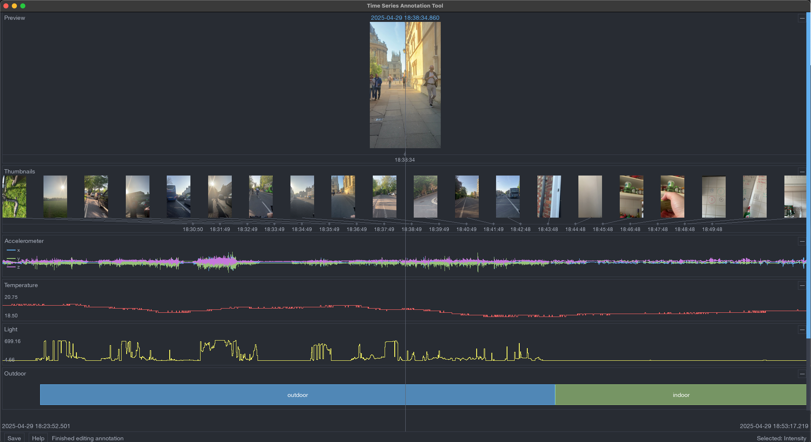

# ActiLabel v2



A Python-based tool for annotating time series data (typically from wearable sensors) and synchronized images. This tool allows you to visualize and annotate multiple data streams simultaneously, making it ideal for labeling sensor data, activity recognition datasets, and other time-synchronized data collections.

## Features

- Multi-channel visualization of time series data (scalar and vector)
- Synchronized image display
- Keyboard-based annotation system with customizable labels
- Interactive timeline navigation
- Zoom and pan controls
- Real-time data visualization

## Installation

1. Clone the repository:
```bash
git clone https://github.com/abramschon/actilabelv2.git
cd actilabelv2
```

With [uv](https://docs.astral.sh/uv/), (the new python package manager) all the dependencies are defined in the pyproject.toml file and will be automatically installed if you have uv installed, so you can go straight to running the programme! 

If you are using processing .cwa data, we rely on [actipy](https://actipy.readthedocs.io/en/latest/), which also requires a java installation.

If you want to manually set up a virtual environment, the required dependencies are:

- actipy >= 3.5.0 # for reading in .cwa data
- matplotlib >= 3.10.1
- numpy >= 2.2.5
- pandas >= 2.2.3 
- pillow >= 11.2.1 # for handling images
- pygame >= 2.6.1 # what we use for the annotation tool
- pyyaml >= 6.0.2 # for parsing the project configs

These can also be found in the pyproject.toml file.

## Usage

### Labelling studies with timelapse + .cwa data

We provide a command line interface to help label studies with wearable camera and sensor data:

```bash
uv run label_study.py --config project_config.yaml --images /path/to/images --cwa /path/to/data.cwa --output /path/to/output
```

Required arguments:
- `--config` or `-f`: Path to project configuration YAML file
- `--images` or `-i`: Path to the camera input folder containing time-stamped images
- `--cwa` or `-c`: Path to the CWA file of sensor data
- `--output` or `-o`: Path to the annotation output folder

The configuration file (`project_config.yaml`) should specify:
- Timestamp format for image filenames
- Time offset to apply to image timestamps (optional)
- Display settings for preview and thumbnail images
- Annotation channels and their possible labels
- Custom colors for scalar data sources (optional)

Example configuration:
```yaml
# Timestamp format for image filenames
timestamp_format:
  pattern: "%Y%m%d_%H%M%S"  # Example: 20250429_173050
  example: "20250429_173050"  # Example filename for reference

# Time offset to apply to image timestamps
time_offset: "01:00:00"  # Optional: 1 hour delay

# Display settings for images
display_settings:
  preview:
    size: [300, 300]  # Width and height of preview image
    max_images: 1     # Number of preview images to show
  thumbnails:
    size: [100, 100]  # Width and height of thumbnail images
    max_images: 10    # Number of thumbnail images to show

# Annotation channels and their possible labels
annotation_channels:
  - name: "Outdoor"
    labels:
      - "outdoor"
      - "indoor"
  - name: "Intensity"
    labels:
      - "sedentary"
      - "light"
      - "moderate"
      - "vigorous"

# Optional: Custom colors for scalar data sources
scalar_colors:
  Temperature: [255, 100, 100]  # Red
  Light: [255, 255, 100]        # Yellow
```

### Running a colourful example

To try out the tool with example data:

```bash
uv run example.py
```

This will create a sample dataset with:
- Images of varying shades of colours
- 3-axis accelerometer data (100Hz)
- Temperature readings (1Hz)
- Light sensor readings (1Hz)
- Two annotation channels: "Location" and "Activity"

### Using Your Own Data

To use the tool with your own data, create instances of the appropriate data source classes:

```python
from main import AnnotationTool, VectorDataSource, ScalarDataSource, ImageDataSource, AnnotationChannel

# Create data sources
accel_source = VectorDataSource(
    "Accelerometer",
    timestamps,  # numpy array of np.datetime64
    data,       # numpy array of shape (n_samples, n_dimensions)
    dim_names=["X", "Y", "Z"]
)

# Create annotation channels
activity_channel = AnnotationChannel(
    "Activity",
    ["walking", "running", "sitting"]  # possible labels
)

# Create and run the tool
tool = AnnotationTool()
tool.load_data([accel_source], [activity_channel])
tool.run()
```

## Controls

### Navigation
- Left/Right Arrow: Move timeline
- =/- or +/-: Zoom in/out
- Space: Start creating a new annotation
- Enter: Finish creating annotation (when editing)
- F1: Toggle help display
- Tab: Switch between annotation channels (when not editing)
- Up/Down: Select channels (when not editing) or navigate through label suggestions (when editing)

### Annotation
1. Press Space to start a new annotation
2. Type the label (autocomplete suggestions will appear)
3. Use Up/Down arrows to navigate suggestions
4. Press Tab to accept suggestion or continue typing
5. Press Enter to create the annotation

## Data Sources

The tool supports three types of data sources:

1. `ScalarDataSource`: For single-value time series (e.g., temperature, light)
2. `VectorDataSource`: For multi-dimensional time series (e.g., accelerometer)
3. `ImageDataSource`: For synchronized images or video frames

## Contributing

Contributions are welcome! Please feel free to submit a Pull Request.